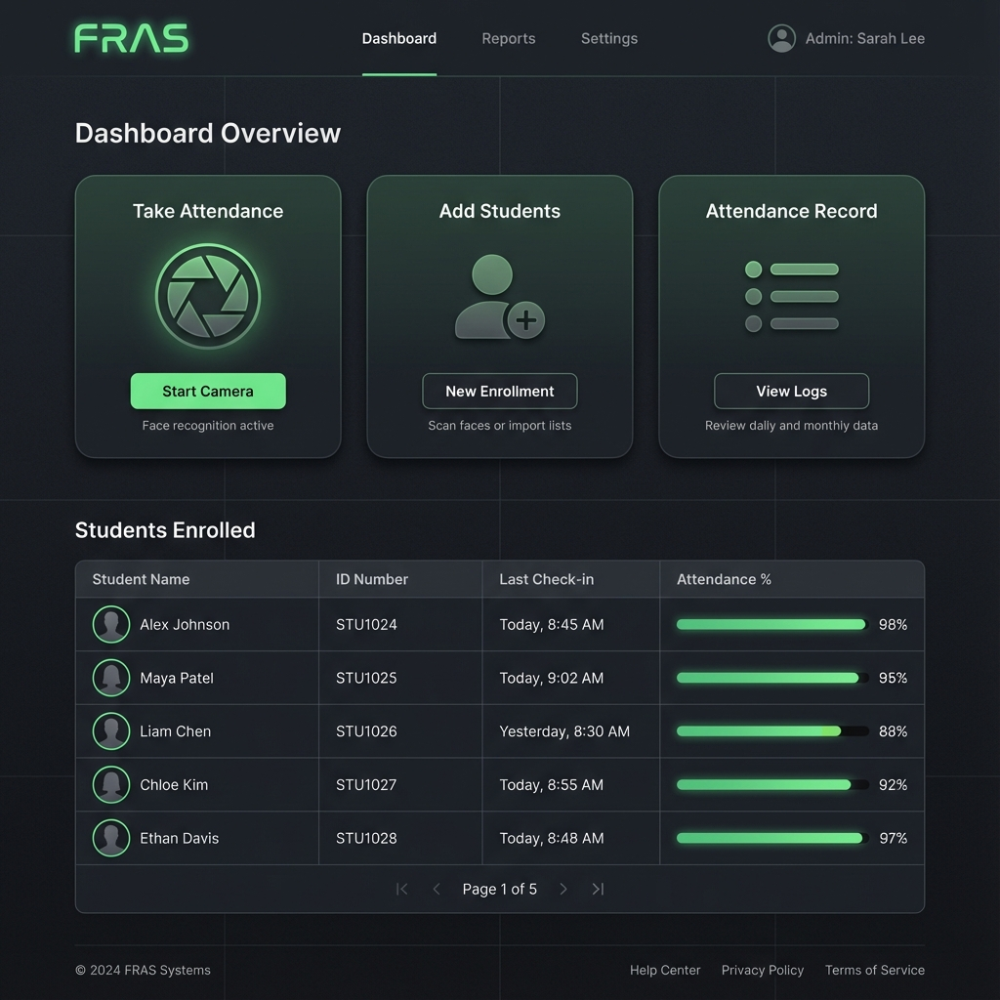
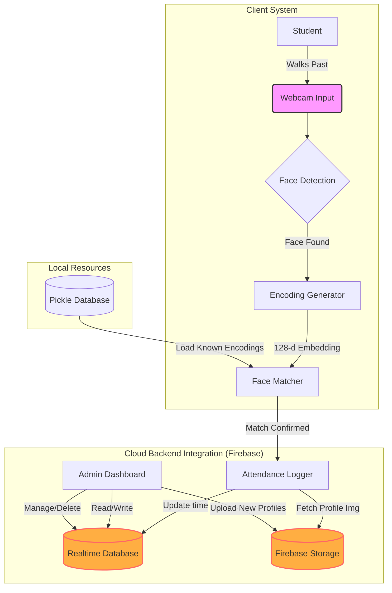

# 🧠 Cognito - Intelligent Attendance System


**Cognito** is a cutting-edge, real-time facial recognition attendance system designed to streamline academic and corporate attendance tracking. Built with Python and Flask, it leverages powerful computer vision libraries to detect, recognize, and log attendance instantly to a cloud-based Firebase backend.

---

## 📸 Dashboard Preview



*Conceptual wireframe of the admin interface.*

---

## 🏗️ System Architecture

The system follows a modular architecture integrating local processing with cloud data management.



---

## ✨ Key Features

- **Real-Time Recognition**: Identifies registered users in milliseconds using `dlib` state-of-the-art face recognition.
- **Live Attendance Logging**: Automatically updates check-in times in **Firebase Realtime Database**.
- **Wait-Time Logic**: Smart "elapsed time" calculation prevents duplicate entries within a set timeframe.
- **Admin Dashboard**:
    - **Take Attendance**: Live video feed with overlay graphics for recognition status.
    - **Add Students**: Easy interface to register new users (ID, Name, Major).
    - **Attendance List**: View and download daily attendance logs as CSV.
- **Cloud Storage**: Student profile images are securely stored and retrieved from **Firebase Storage**.

---

## 🛠️ Tech Stack

| Component | Technology | Description |
| :--- | :--- | :--- |
| **Backend** |  | Lightweight WSGI web application framework. |
| **Vision** |  | Real-time computer vision processing. |
| **AI/ML** | `face_recognition`, `dlib` | Deep metric learning for face encoding. |
| **Database** |  | NoSQL cloud database for real-time syncing. |
| **Frontend** | HTML5, CSS3, JavaScript | Responsive admin interface. |

---

## 🚀 Getting Started

### Prerequisites
- Python 3.8+ (Tested with 3.13)
- A generic USB Webcam

### Installation

1.  **Clone the Repository**
    ```bash
    git clone https://github.com/architpr/Cognito-attendance-System.git
    cd Cognito-attendance-System
    ```

2.  **Create & Activate Virtual Environment** (Recommended)
    ```powershell
    # Windows
    python -m venv venv
    .\venv\Scripts\activate
    ```

3.  **Install Dependencies**
    > **Note**: `dlib` can be tricky on Windows. If `pip install dlib` fails, download a pre-compiled wheel (e.g., from [cp313-win_amd64](https://github.com/z-mahmud22/Dlib_Windows_Python3.x/)) or install CMake and Visual Studio build tools first.
    ```bash
    pip install -r requirements_no_version.txt
    ```

4.  **Firebase Setup**
    - Create a Firebase Project.
    - Enable **Realtime Database** and **Storage**.
    - Download your `serviceAccountKey.json` from Firebase Console -> Project Settings -> Service Accounts.
    - Place `serviceAccountKey.json` in the root directory.

5.  **Run the Application**
    ```bash
    python app.py
    ```
    Access the dashboard at `http://127.0.0.1:5000`.

---

## 📂 Project Structure

```bash
📂 Cognito-attendance-System
├── 📂 static/              # CSS, JS, and Assets
│   └── 📂 Files/           # Generated/Uploaded Resources
├── 📂 templates/           # HTML Templates (Admin, Login, etc.)
├── app.py                  # Main Flask Application
├── EncodeGenerator.py      # Script to generate encodings
├── database_actions.py     # Database helper functions
└── requirements.txt        # Dependencies
```

## 🤝 Contributing

Contributions are welcome! Please fork this repository and submit a pull request.

---
*Built with ❤️ by the Cognito Team*
